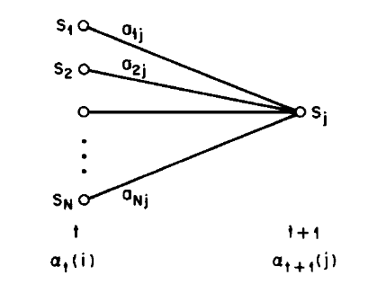
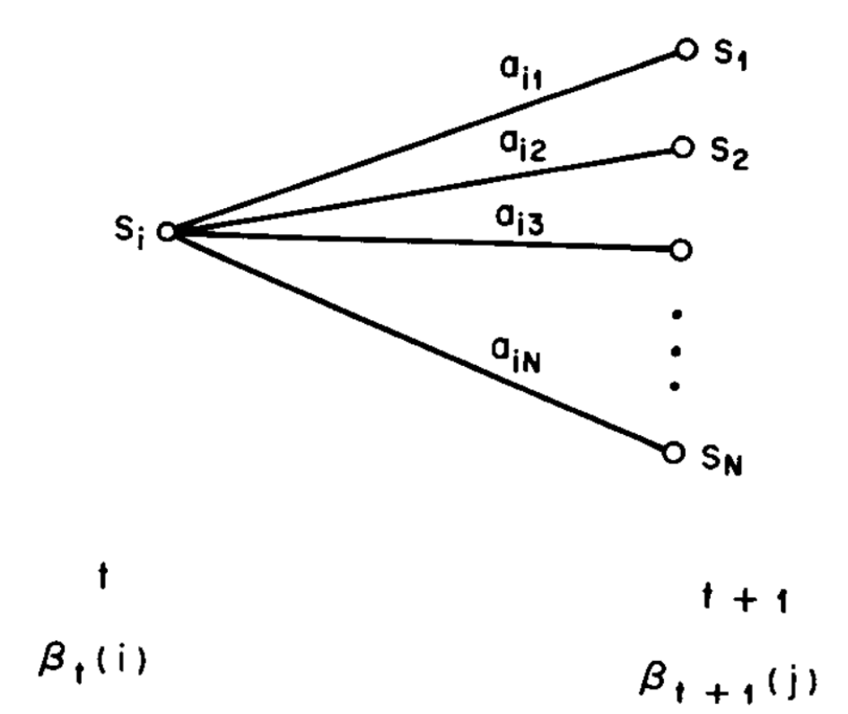
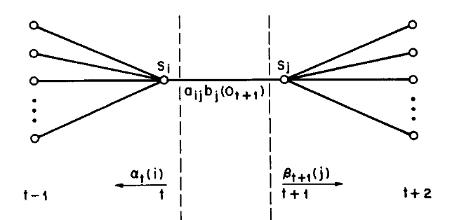

# Forward-backward algorithm to calucate the overall score

## Forward variable
$$\begin{equation}
α_t (i)=P(O_1 O_2 \ldots O_t, q_t=S_i│λ)
\end{equation}$$

The probability of the partial observation sequence from time $t+1$ to the end
given state $S_i$  at time t and the model $\lambda$.

**Why $q_t=S_i$ i on the right for $\alpha$ s but on the right for $\beta$ s?**

    

Steps to calculate $\alpha$:
1. initiation:
    $$\begin{equation}
    α_1 (i)= \pi_i b_i(O_1)
    \end{equation}$$
2. induction:
    $$\begin{equation}
    α_{t+1}(i)= \left[ \sum_{i=1}^N \alpha_t(i) a_{ij}\right ] b_j(O_{t+1})
    \end{equation}$$
3. termination
    $$\begin{equation}
    P(O|\lambda) = \sum_{i=1}^N \alpha_T(i) 
    \end{equation}$$

### The overall score
$$\begin{equation}
P(O|\lambda) = \sum_{i=1}^N P(O_1O_2\ldots O_T, q_T=S_i|\lambda)
= \sum_{i=1}^N \alpha_T(i) 
\end{equation}$$

## Backward variable
$$\begin{equation}
β_t (i)=P(O_{t+1} O_{t+2}\ldots O_T |q_t=S_i, λ)
\end{equation}$$

The probability of the partial observation sequence from time t+1 to the end
given state S_i  at time t and the model λ.
$\beta$ s are NOT needed for calculating best score but can be useful for Baum-Welch algorithm

    

Steps to calculate $\beta$:
1. initiation:
    $$\begin{equation}
    \beta_T (i)= 1
    \end{equation}$$
2. induction:
    $$\begin{equation}
    \beta_t(i) = \sum_{j=1}^N a_{ij}b_j(O_{t+1})\beta_{t+1}(j),
    \end{equation}$$

## Gamma variable
$$\begin{equation}
\gamma_t(i) = P(q_t = S_i | O, \lambda)
\end{equation} $$
The probability of being in state $S_i$ at time $t$, given the observation sequence
$O$ and the model $\lambda$. It can expressed as $\alpha$ and $\beta$:
$$\begin{equation}
\gamma_t(i) = \frac{\alpha_t(i)\beta_t(i)}{P(O|\lambda)}
\end{equation} $$
where,
$$\begin{equation}
P(O|\lambda) = \sum_{i=1}^N \alpha_t(i)\beta_t(i)
\end{equation} $$

# Baum-Welch algorithm to update model

## $\xi$ variable
$$\begin{equation}
\xi_t(i,j)= \frac{ \alpha_t(i)a_{ij}b_j(O_{t+1})\beta_{t+1}(j)
}{ P(O|\lambda) }
\end{equation}$$
where
$$\begin{equation}
P(O|\lambda) = \sum_{i=1}^N \sum_{j=1}^N \alpha_{ij}b_j(O_{t+1})\beta_{t+1}(j)
\end{equation}$$
The probability of being in state $S_i$ at time $t$ and state $S_j$ at time $t+1$,
given the model and the observation sequences.

    

Also we can get from $\xi$ that
$$\begin{equation}
\gamma_t(i) = \sum_{j=1}^N \xi_t(i, j)
\end{equation}$$

## model parameters reestimation
Use the expected frequency (number of times) in state $S_i$ at time $t=1$ to estimate
$\pi$
$$\begin{equation}
\overline{\pi_i} = \gamma_1(i)
\end{equation}$$

Use the ratio of the expected number of transion from state $S_i$ to state $S_j$ 
to the expected number of transitions from state $S_i$ to estimate $a$
$$\begin{equation}
\overline{a_{ij}} = \frac{\sum_{t=1}^{T-1}\xi_t(i,j)}{\sum_{t=1}^{T-1}\gamma_t(i)}
\end{equation}$$

Use the ratio of the expected number of times in state $j$ and observing symbol $v_k$ 
to the expected number of times in state $j$ to estimate $b$
$$\begin{equation}
\overline{b_i(k)} = \frac{\sum_{t=1, s.t. O_t=v_k}^{T}\gamma_t(j)}{\sum_{t=1}^{T}\gamma_t(i)}
\end{equation}$$

# Viterbi variables to find the path

## Best score at time t

$$\begin{equation}
\delta_t = \max_{q_1, q_2, \dots, q_{t-1}} P(q_1 q_2 \ldots q_t, O_1 O_2 \ldots O_t|\lambda)
\end{equation}$$
The best score (highest probability) along a single path, at time $t$, which accounts for the first $t$ observations and ends in state $S_i$. For induction,

$$\begin{equation}
\delta_{t+1}(j) =  [\max_i \delta_t(i)a_{ij}] \cdot b_j(O({t+1})
\end{equation}$$

$\psi_t(j) $ is the value of $i$ that maximize $\delta$ for $t$ and $j$.

Steps to calculate $\delta$, $\psi$ and the best path:
1. initiation:
    $$\begin{equation}
    \delta_1(i) = \pi_i b_i(O_1)
    \end{equation}$$
    $$\begin{equation}
    \psi_1(i) = 0
    \end{equation}$$
2. induction:
    $$\begin{equation}
    \delta_t(j) = \max_{1\le i\le N} \left[ \delta_{t-1}(i)a_{ij}\right]b_j(O_t)
    \end{equation}$$
    $$\begin{equation}
    \psi_t(j) = \argmax_{1\le i\le N} \left[ \delta_{t-1}(i)a_{ij}\right]
    \end{equation}$$
3. termination
    $$\begin{equation}
    P^* = \max_{1 \le i \le N} \delta_T(i)
    \end{equation}$$
    $$\begin{equation}
    q_T^* = \argmax_{1 \le i \le N} \delta_T(i)
    \end{equation}$$
4. path backtracking
    $$\begin{equation}
    q_t^* = \psi_{t+1} (q_{t+1}^*)
    \end{equation}$$
